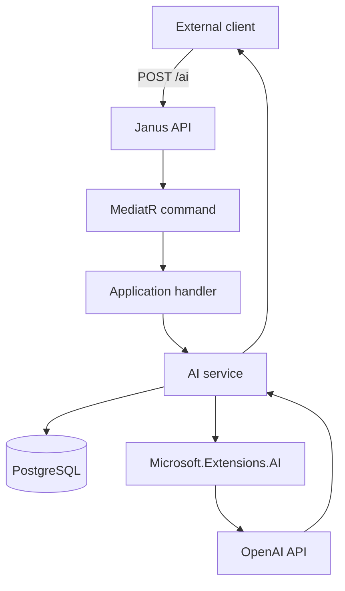
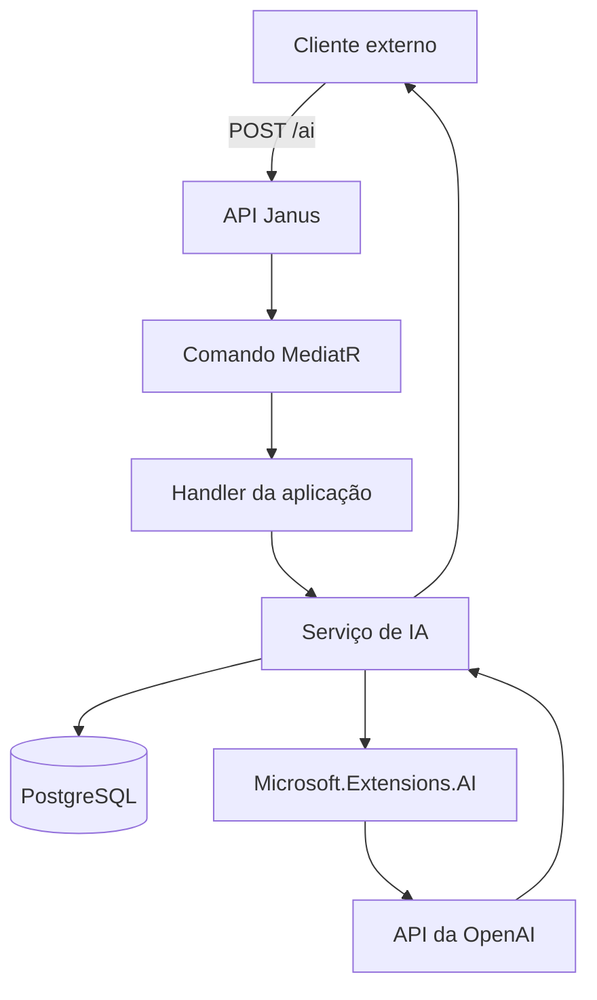

# Janus

> Secure, configurable gateway between external clients, AI providers, and services hosted in the Logos ecosystem.

[Português](#português) · [English](#english)

Janus is currently under active development. Its first working use case connects a portfolio chat to OpenAI through a server-side ASP.NET Core API, keeping provider credentials and service configuration away from the browser.

---

## English

### Overview

Janus is the gateway of the [Logos](https://gustavosoares.dev.br) server ecosystem. It provides a single, controlled entry point for applications that need to communicate with AI providers or other internal services.

The main idea is deliberately simple:

- external clients never receive provider credentials;
- clients identify themselves and send an input to Janus;
- Janus loads the configuration associated with that client;
- Janus calls the configured provider from the server;
- only the resulting response is returned to the caller.

The first integration is an AI assistant for Gustavo Soares' portfolio. The design is not tied to the portfolio, however: other applications can use the same gateway and have their own provider, model, instructions, limits, and storage policy.

### Why Janus?

Static frontends such as GitHub Pages cannot safely store OpenAI API keys. Calling a provider directly from the browser would expose credentials and bypass centralized controls.

Janus introduces a trusted server-side boundary where the system can enforce:

- secure secret handling;
- client-specific AI configuration;
- input and output limits;
- provider abstraction;
- centralized validation and observability;
- future authentication, authorization, rate limiting, and usage policies.

### Current request flow



1. The caller sends its `clientId` and message to `POST /ai`.
2. The API forwards the request through MediatR.
3. The application handler delegates provider communication to `IAiService`.
4. The infrastructure service loads the client and its optional AI configuration from PostgreSQL.
5. The request is created using the stored model, instructions, output limit, and storage preference.
6. `Microsoft.Extensions.AI` sends the request through the configured `IChatClient`.
7. Janus returns the provider response to the original caller.

### Architecture

Janus follows Clean Architecture principles and keeps business rules independent from frameworks and external providers.

```text
Janus.Api
├── HTTP endpoints and ASP.NET Core configuration
│
Janus.Application
├── Use cases, DTOs, commands, handlers, and service contracts
│
Janus.Domain
├── Core entities and business rules
│
Janus.Infrastructure
├── EF Core, PostgreSQL, repositories, AI provider integration, and migrations
│
Janus.CrossCutting
└── Dependency injection and composition root extensions
```

Dependency direction:

```text
Api → CrossCutting → Application
                   → Infrastructure → Application → Domain
```

The Application layer depends on abstractions such as `IAiService`. Provider-specific communication remains in Infrastructure.

### Domain model

#### Client

A `Client` represents an application or destination allowed to use Janus, such as the portfolio. A client may or may not have an AI service configured.

| Property | Purpose |
|---|---|
| `Id` | Unique client identifier |
| `Name` | Human-readable client name |
| `IaId` | Optional AI configuration identifier |
| `Ia` | Optional AI service configuration |

#### Ia

`Ia` represents an AI service configuration available to a client. It is not a user profile.

| Property | Purpose |
|---|---|
| `Provider` | AI provider, initially OpenAI |
| `Model` | Provider model identifier |
| `Instructions` | Client-specific system instructions |
| `MaxOutputTokens` | Maximum response size |
| `Store` | Whether provider-side response storage is enabled |

This design allows different clients to share the Janus gateway while maintaining independent behavior and limits.

### API

Current endpoint:

```http
POST /ai
Content-Type: application/json
```

Example request:

```json
{
  "clientId": "00000000-0000-0000-0000-000000000000",
  "input": "Tell me about Gustavo's Logos Server project."
}
```

The exact public contract may evolve while the project is in its initial development phase.

### Technology stack

- .NET 10
- ASP.NET Core Web API
- MediatR
- Entity Framework Core
- PostgreSQL 18
- Npgsql
- Microsoft.Extensions.AI
- OpenAI .NET SDK
- Docker and Docker Compose
- OpenAPI

### Configuration

Janus reads hierarchical .NET configuration from environment variables. Double underscores are converted into configuration separators.

Create a private environment file outside source control:

```env
ASPNETCORE_ENVIRONMENT=Production
ASPNETCORE_HTTP_PORTS=8080
ConnectionStrings__DefaultConnection=Host=postgres;Port=5432;Database=janus;Username=janus;Password=CHANGE_ME
OpenAI__ApiKey=CHANGE_ME
```

Example Compose configuration:

```yaml
services:
  janus:
    build:
      context: .
      dockerfile: Janus.Api/Dockerfile
    env_file:
      - /secure/path/janus.env
    ports:
      - "8080:8080"
```

Never commit `.env` files, connection strings, API keys, or application settings containing secrets.

### Running locally

Prerequisites:

- .NET 10 SDK
- Docker with Docker Compose
- an OpenAI API key

After cloning the repository and creating the environment file:

```bash
dotnet restore
dotnet build
docker compose up -d --build
```

When automatic startup migration is enabled, Janus applies pending EF Core migrations before serving requests. Database availability should be checked before application startup in production deployments.

### Deployment

Janus is designed to run as a Docker container on the Logos Ubuntu Server. In the current environment:

- PostgreSQL runs as an independent container;
- Janus and PostgreSQL communicate through a private Docker network;
- secrets are injected at runtime through an environment file stored outside the repository;
- the API can be exposed through a secure tunnel or reverse proxy;
- the OpenAI key exists only on the server.

The application image can be published to a container registry so the server only needs the Compose definition and its private environment file.

### Security principles

- Never expose provider keys to frontend applications.
- Never bake secrets into Docker images.
- Keep production environment files outside Git and restrict their filesystem permissions.
- Validate client identifiers and request payloads.
- Restrict input and output sizes.
- Do not disclose internal instructions in responses.
- Apply authentication, authorization, rate limiting, and abuse protection before broader public usage.
- Rotate a credential immediately if it is accidentally exposed.

### Project status

Implemented foundation:

- layered Clean Architecture solution;
- ASP.NET Core controller and MediatR request flow;
- PostgreSQL persistence through EF Core;
- `Client` and optional `Ia` relationship;
- client-specific model and instruction lookup;
- OpenAI communication through `Microsoft.Extensions.AI`;
- Dockerized API and database workflow;
- startup database migrations and initial development data.

Planned evolution:

- authentication and client credentials;
- per-client rate limits and quotas;
- validation and standardized error responses;
- conversation history policy;
- provider factory for multiple AI providers;
- streaming responses;
- health checks and structured observability;
- automated tests and CI;
- additional Logos services beyond AI;
- stable versioned API contracts.

### Contributing

Janus is being developed openly and contributions will be welcome as the public contracts stabilize. Before submitting changes:

1. open an issue describing the proposal;
2. keep dependencies pointing inward according to Clean Architecture;
3. do not introduce provider-specific concerns into the Domain layer;
4. include tests for new behavior;
5. never include credentials or private infrastructure details.

---

## Português

### Visão geral

Janus é o gateway do ecossistema do servidor [Logos](https://gustavosoares.dev.br). Ele oferece um único ponto de entrada controlado para aplicações que precisam se comunicar com provedores de IA ou outros serviços internos.

A ideia central é propositalmente simples:

- clientes externos nunca recebem credenciais dos provedores;
- o cliente se identifica e envia uma entrada para o Janus;
- o Janus carrega a configuração associada àquele cliente;
- o Janus chama o provedor configurado a partir do servidor;
- somente a resposta resultante retorna para quem fez a requisição.

A primeira integração é um assistente de IA para o portfólio de Gustavo Soares. Porém, o projeto não é acoplado ao portfólio: outras aplicações podem usar o mesmo gateway com seus próprios provedor, modelo, instruções, limites e política de armazenamento.

### Por que o Janus existe?

Frontends estáticos, como aplicações hospedadas no GitHub Pages, não conseguem armazenar chaves da OpenAI com segurança. Chamar o provedor diretamente pelo navegador exporia as credenciais e impediria controles centralizados.

O Janus cria uma fronteira confiável no servidor onde o sistema pode aplicar:

- tratamento seguro de secrets;
- configuração de IA específica para cada cliente;
- limites de entrada e saída;
- abstração do provedor;
- validação e observabilidade centralizadas;
- futuramente, autenticação, autorização, rate limiting e políticas de uso.

### Fluxo atual da requisição



1. O consumidor envia seu `clientId` e a mensagem para `POST /ai`.
2. A API encaminha a requisição pelo MediatR.
3. O handler da aplicação delega a comunicação com o provedor para `IAiService`.
4. O serviço de infraestrutura consulta no PostgreSQL o cliente e sua configuração opcional de IA.
5. A requisição é criada usando modelo, instruções, limite de saída e preferência de armazenamento cadastrados.
6. O `Microsoft.Extensions.AI` envia a requisição através do `IChatClient` configurado.
7. O Janus devolve a resposta do provedor ao cliente original.

### Arquitetura

O Janus segue os princípios da Clean Architecture e mantém as regras de negócio independentes de frameworks e provedores externos.

```text
Janus.Api
├── Endpoints HTTP e configuração do ASP.NET Core
│
Janus.Application
├── Casos de uso, DTOs, commands, handlers e contratos de serviços
│
Janus.Domain
├── Entidades centrais e regras de negócio
│
Janus.Infrastructure
├── EF Core, PostgreSQL, repositórios, integração com IA e migrations
│
Janus.CrossCutting
└── Injeção de dependência e composição da aplicação
```

Direção das dependências:

```text
Api → CrossCutting → Application
                   → Infrastructure → Application → Domain
```

A camada Application depende de abstrações como `IAiService`. A comunicação específica com provedores permanece na Infrastructure.

### Modelo de domínio

#### Client

Um `Client` representa uma aplicação ou destino autorizado a usar o Janus, como o portfólio. O cliente pode ou não possuir um serviço de IA configurado.

| Propriedade | Finalidade |
|---|---|
| `Id` | Identificador único do cliente |
| `Name` | Nome legível do cliente |
| `IaId` | Identificador opcional da configuração de IA |
| `Ia` | Configuração opcional do serviço de IA |

#### Ia

`Ia` representa a configuração de um serviço de inteligência artificial disponível para um cliente. Ela não representa um perfil de usuário.

| Propriedade | Finalidade |
|---|---|
| `Provider` | Provedor de IA, inicialmente OpenAI |
| `Model` | Identificador do modelo no provedor |
| `Instructions` | Instruções de sistema específicas do cliente |
| `MaxOutputTokens` | Tamanho máximo da resposta |
| `Store` | Define se o armazenamento da resposta pelo provedor está habilitado |

Esse desenho permite que clientes diferentes compartilhem o gateway Janus mantendo comportamentos e limites independentes.

### API

Endpoint atual:

```http
POST /ai
Content-Type: application/json
```

Exemplo de requisição:

```json
{
  "clientId": "00000000-0000-0000-0000-000000000000",
  "input": "Fale sobre o projeto Logos Server do Gustavo."
}
```

O contrato público exato ainda pode evoluir durante a fase inicial de desenvolvimento.

### Tecnologias

- .NET 10
- ASP.NET Core Web API
- MediatR
- Entity Framework Core
- PostgreSQL 18
- Npgsql
- Microsoft.Extensions.AI
- SDK .NET da OpenAI
- Docker e Docker Compose
- OpenAPI

### Configuração

O Janus lê configurações hierárquicas do .NET através de variáveis de ambiente. Dois underlines são convertidos em separadores de configuração.

Crie um arquivo de ambiente privado fora do controle de versão:

```env
ASPNETCORE_ENVIRONMENT=Production
ASPNETCORE_HTTP_PORTS=8080
ConnectionStrings__DefaultConnection=Host=postgres;Port=5432;Database=janus;Username=janus;Password=CHANGE_ME
OpenAI__ApiKey=CHANGE_ME
```

Exemplo de configuração do Compose:

```yaml
services:
  janus:
    build:
      context: .
      dockerfile: Janus.Api/Dockerfile
    env_file:
      - /secure/path/janus.env
    ports:
      - "8080:8080"
```

Nunca faça commit de arquivos `.env`, strings de conexão, chaves de API ou arquivos de configuração contendo secrets.

### Executando localmente

Pré-requisitos:

- SDK do .NET 10
- Docker com Docker Compose
- uma chave da API da OpenAI

Depois de clonar o repositório e criar o arquivo de ambiente:

```bash
dotnet restore
dotnet build
docker compose up -d --build
```

Quando a migração automática na inicialização estiver habilitada, o Janus aplica migrations pendentes do EF Core antes de atender requisições. Em produção, a disponibilidade do banco deve ser verificada antes da inicialização da aplicação.

### Deploy

O Janus foi projetado para rodar como container Docker no Ubuntu Server do Logos. No ambiente atual:

- o PostgreSQL roda em um container independente;
- Janus e PostgreSQL se comunicam por uma rede Docker privada;
- secrets são injetadas em runtime por um arquivo de ambiente fora do repositório;
- a API pode ser publicada por um túnel seguro ou proxy reverso;
- a chave da OpenAI existe apenas no servidor.

A imagem da aplicação pode ser publicada em um registry, permitindo que o servidor precise apenas da definição do Compose e do arquivo de ambiente privado.

### Princípios de segurança

- Nunca expor chaves de provedores para aplicações frontend.
- Nunca inserir secrets dentro de imagens Docker.
- Manter arquivos de ambiente de produção fora do Git e restringir suas permissões no sistema de arquivos.
- Validar identificadores de clientes e payloads.
- Limitar os tamanhos de entrada e saída.
- Não revelar instruções internas nas respostas.
- Aplicar autenticação, autorização, rate limiting e proteção contra abuso antes de ampliar o uso público.
- Rotacionar imediatamente qualquer credencial exposta acidentalmente.

### Estado do projeto

Fundação implementada:

- solução em camadas seguindo Clean Architecture;
- controller ASP.NET Core e fluxo de requisição pelo MediatR;
- persistência PostgreSQL através do EF Core;
- relacionamento entre `Client` e `Ia` opcional;
- consulta de modelo e instruções específicas do cliente;
- comunicação com a OpenAI através do `Microsoft.Extensions.AI`;
- fluxo da API e banco em containers Docker;
- migrations na inicialização e dados iniciais de desenvolvimento.

Evoluções planejadas:

- autenticação e credenciais por cliente;
- rate limits e cotas por cliente;
- validação e respostas de erro padronizadas;
- política de histórico das conversas;
- factory de provedores para múltiplas IAs;
- respostas por streaming;
- health checks e observabilidade estruturada;
- testes automatizados e CI;
- novos serviços do Logos além da IA;
- contratos de API estáveis e versionados.

### Como contribuir

O Janus está sendo desenvolvido de forma aberta e contribuições serão bem-vindas à medida que os contratos públicos se estabilizarem. Antes de enviar mudanças:

1. abra uma issue descrevendo a proposta;
2. mantenha as dependências apontando para dentro conforme a Clean Architecture;
3. não introduza detalhes específicos de provedores na camada Domain;
4. inclua testes para novos comportamentos;
5. nunca inclua credenciais ou detalhes privados da infraestrutura.

---

## License

The project is in its initial open-source setup phase. A license file will be added before the first stable release.

## Author

Developed by [Gustavo Soares](https://gustavosoares.dev.br) as part of the Logos Server ecosystem.
